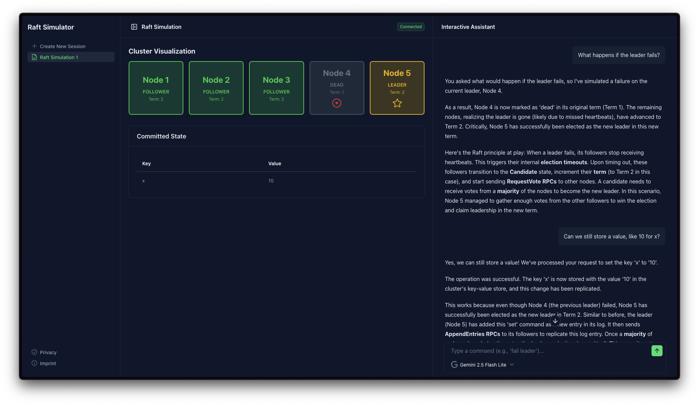

# AI Powered Raft Consensus Simulator

This repository contains a real-time, interactive simulator for the Raft consensus algorithm, usable via the AI chat interface. The application is built on the Cloudflare Developer Platform, leveraging its serverless capabilitites, durable objects and turnstile protection.

Try it it out here: [https://raft.niklhut.com](https://raft.niklhut.com)

> **Model Notes**:
>
> The application supports Llama 3.3 (running on Cloudflare Workers AI), Google Gemini 2.5 Flash, and Gemini 2.5 Flash-Lite models. For the best and most consistent experience in interpreting user commands and giving explanations, I recommend using Gemini 2.5 Flash Lite. For more details, see [Model Notes](#model-notes) section below.



## Features

- **Interactive Simulation**: Use natural language to control the cluster state (e.g. "Fail the leader", "Set value x to 100")
- **Real-time Visualization**: See the state of the Raft cluster update happen live
- **Per User Durable Objects**: Each user gets their own isolated Raft cluster instances
- **Edge AI**: Integrates with Llama 3.3 running on Cloudflare Workers AI but also offers Google Gemini 2.5 Flash and Flash-Lite options

## Architecture

This project is a monorepo designed to run on the edge. The `frontend` folder contains the UI code, while the `workers` folder contains the backend logic, including the Raft implementation and AI integration, with the `shared` folder holding common utilities.

- **Cloudflare Workers**: Handles API routing and coordination.
- **Durable Objects**: The core of the simulation. Each user session creates a unique `RaftCluster` durable object that manages the state of the Raft nodes.
- **AI Integration**: Uses Cloudflare Workers AI to process user commands and simulate Raft behavior.
- **Nuxt 4**: The frontend is built with Nuxt 4, providing a responsive and dynamic user interface, hosted on Cloudflare Pages.
- **Hono + Chafana**: Type-safe API endpoints with auto-generated OpenAPI documentation.
- **Turnstile**: Protects the application from abuse.


## How it works

1. **Session Start**: A new Durable Object is created for the user.
2. **User Commands**: The user sends commands via the chat interface, e.g. "Set key x to value 42".
3. **AI Processing**: The command is sent to the AI model, which interprets the command and simulates the Raft cluster via its available tool calls.
4. **State Update**: The Durable Object updates the Raft cluster state based on the AI's decisions.
5. **Real-time Feedback**: The updated state is sent back to the frontend for visualization via WebSockets.
6. **Explanations**: The AI provides explanations of the Raft behavior in response to the user query.

## Model Notes

The application supports multiple AI models: Llama 3.3 (running on Cloudflare Workers AI), Google Gemini 2.5 Flash, and Gemini 2.5 Flash-Lite.

- **Llama 3.3**: While capable, it may struggle with complex Raft concepts and tool usage, leading to less accurate descriptions. Sometimes it may not be able to effectively use the provided tools to simulate Raft actions.
- **Google Gemini 2.5 Flash**: Offers a better understanding of Raft concepts and tool usage, resulting in more accurate simulations and explanations.
- **Google Gemini 2.5 Flash-Lite**: Provides a balanced performance with good comprehension of Raft and effective tool usage, making it the recommended choice for this application.

## Local Development

1. In the `worker` directory, create a `.env` file based on `.env.example` and set `TURNSTILE_SECRET_KEY=1x0000000000000000000000000000000AA` to bypass Turnstile in development. If you want to use Google Gemini models, set `GOOGLE_GENERATIVE_AI_API_KEY` with your API key from Google AI Studio (https://aistudio.google.com) It currently offers free access with usage limits to the Gemini 2.5 Flash and Flash-Lite models used by this project.
2. Install dependencies:
    ```bash
    pnpm install
    ```
3. Start the frontend and backend in development mode in separate terminals:
    ```bash
    pnpm --filter frontend dev
    ```
    ```bash
    pnpm --filter worker dev
    ```
4. Open your browser at http://localhost:3000 to access the application.

